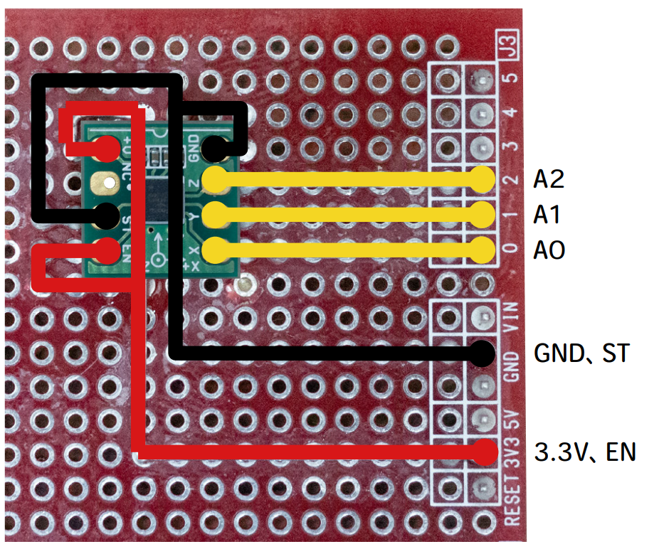

# 加速度検出式サボり防止デバイス（笑）
## 雑なつくりかたまとめ
※タイマーは実装していないのでセンサーが閾値を超過したらすぐに鳴ります．（ね？雑でしょ？）

### 材料
* Arduino Uno（とUSBケーブル）  
* 電子ブザー（70円）：https://akizukidenshi.com/catalog/g/gP-09800/  
* 加速度センサー（500円）：https://akizukidenshi.com/catalog/g/gK-15232/  
* 適当な導線  
* USBを差せる電源（PC，モバイルバッテリー，ACアダプターなどなんでもいい）  

### 作り方
  
1． 加速度センサーを結線する（上図の赤線を3.3，黒線をGND，Y軸の黄色線をA0につなぐ．残り2本は繋がない）  
2． ブザーの＋側を7番ピン，反対側をGNDに結線する  
3． プログラム（pen.ino）を書き込む  
4． USBを差す．  
以上．  
  
センサーの値には個体差があるかもしれないので適宜調整してください．  
